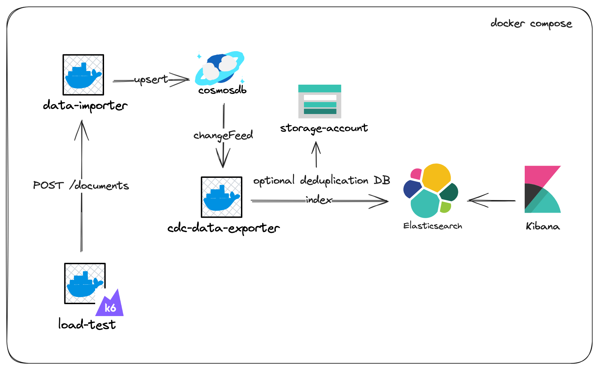

# io-platform-poc-elk

## Scope
This repo implements a POC that allows elasticsearch's indice ingestion throughout a Change Data Capture
trigger (namely Cosmos Change Feed).
All services are built on top of a docker-compose environment

## Architecture
